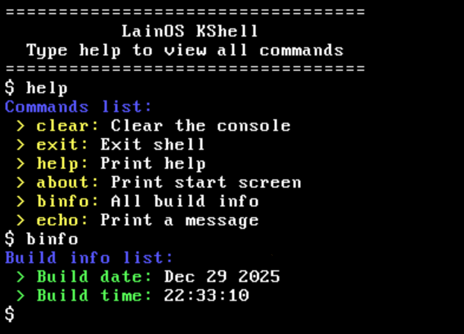

# Lain OS

**Lain OS** is my very first operating system project. It’s part of my learning journey — I want to see how far I can take it.

---

## How It Works

The kernel runs in **64-bit mode** and includes a built-in **shell** and **UI system**. My long-term goal is to make it capable of running and supporting Linux software.

I’ve built a **custom bootloader** in assembly, which I plan to expand to be more like GRUB. For now, it only supports **Legacy BIOS**, but eventually, I want it to boot on **UEFI** systems as well.

---

## Roadmap

| Component              | Status    |
| ---------------------- | --------- |
| Bootloader             | ✅ Done    |
| Kernel                 | ✅ Done    |
| IDT                    | ✅ Done    |
| ISR / IRQ Manager      | ✅ Done    |
| PIC                    | ✅ Done    |
| Keyboard & VGA Drivers | ✅ Done    |
| Print Driver           | ✅ Done    |
| Mini Shell             | ✅ Done    |
| Long mode              | ❌ Not yet |
| Paging                 | ❌ Not yet |
| Virtual Memory         | ❌ Not yet |
| User Mode              | ❌ Not yet |
| File System            | ❌ Not yet |

i

